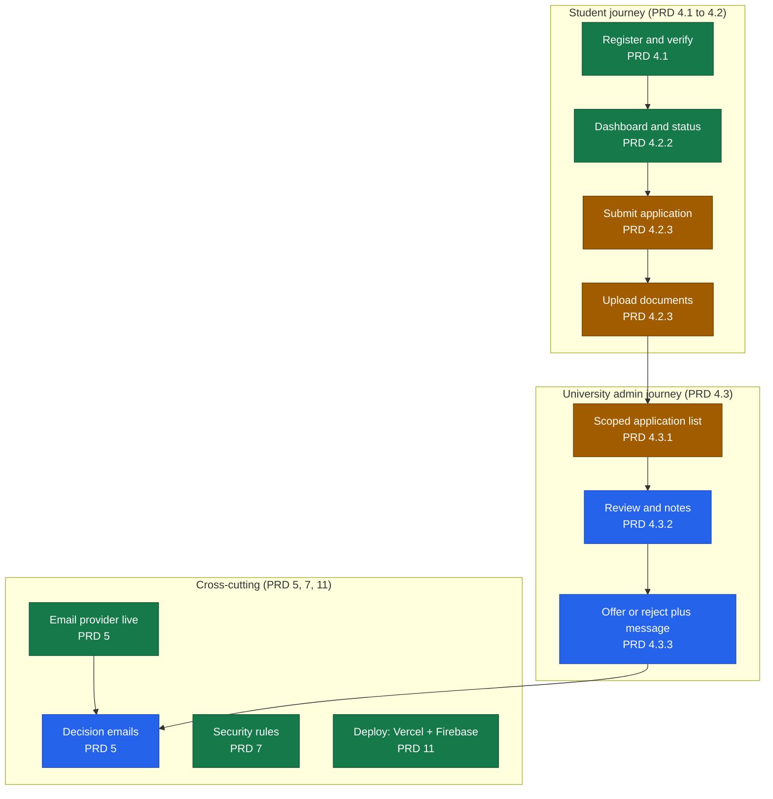

# PRD Compliance

This page shows, at a glance, how UAAMS tracks against the Project Requirements Document (`PRD - University Administration & Application Management System`). It is the single visual place to answer one question: **are we building what the PRD asked for?**

- Source of truth: the PRD (sections referenced below as PRD 4.1, 4.2.1, etc.).
- Status reflects code merged into `develop` plus recorded evidence on the linked issues/PRs.
- This document is maintained when a feature or its acceptance evidence changes. It does not mark work "Met" from compilation alone - live acceptance is called out separately.

## Legend

| Badge | Meaning |
|---|---|
| Met | Built, merged, and evidenced against the PRD requirement. |
| Pending | Built and merged, but live acceptance evidence is still being captured. |
| Planned | Scheduled for Week 3 of Sprint 2 by the agreed plan. |
| Future | Explicitly out of PRD scope (PRD 13) or an evolved-ERD proposal awaiting stakeholder approval. |

## Requirement map

Colour and text both carry the status (green = Met, amber = Pending, blue = Planned), so the map is readable without relying on colour alone.

## Compliance detail

| PRD section | Requirement | Status | Evidence |
|---|---|---|---|
| 4.1 | Email/password auth, role-based access, email verification, password reset, route protection | Met | `lib/auth.js`, `firestore.rules`, auth routes; PR #29, PR #68; #7, #8 |
| 4.2.1 | Student registration (name, email, password, privacy) | Met | `/register`; PR #29 |
| 4.2.1 | Registration: nationality + intended study level | Pending | Collected in UI; not yet persisted pending schema sign-off (`lib/auth.js` note) |
| 4.2.2 | Dashboard: view applications and the five statuses | Met | `/student`; PR #67, PR #68; #9 |
| 4.2.3 | Application submission (personal, academic, course info) | Pending | `/apply` form merged; live submission acceptance pending; PR #67; #10 |
| 4.2.3 | Document upload with size/format validation | Pending | Upload merged; bucket live; APP-03–06 acceptance pending; PR #67; #11, #6 |
| 4.3.1 | Admin dashboard: applications scoped to their university | Pending | `/admin` list merged; admin-login acceptance shot pending; PR #63; #12 |
| 4.3.1 | Filter by status, search, counts per status | Planned | Extends the list view; Week 3 |
| 4.3.2 | Review: full profile, download documents, internal notes, status change | Planned | Detail view; Week 3; #13 |
| 4.3.3 | Offer/reject, custom message, saved, email sent, history logged | Planned | Decision flow #15 (Week 3); decision-email endpoint merged early (PR #65) |
| 5 | Email provider, env-var credentials, verification email | Met | Resend connected, live send confirmed; PR #64; #16, #17 |
| 5 | Submission/status/offer/rejection emails, HTML templates, email logs | Planned | Reusable sender in place; events wired in Week 3; #18, #19 |
| 6 | Firestore collections: users, universities, applications, documents | Met | `lib/db.js`, `firestore.rules`, `firestore.indexes.json`; documents added additively |
| 6 | notifications collection | Future | Notification centre is an evolved-ERD proposal, not required by base PRD |
| 7 | Security rules, role-based access, secure document access, no frontend secrets | Met | `firestore.rules`, `storage.rules`; server-only email route |
| 7 | Pagination / optimized queries / lazy loading | Pending | Composite indexes and lazy Firebase init in place; list pagination in Week 3 |
| 7 | GDPR delete on request | Future | Deferred to Sprint 3 (IS-06); rules currently deny client delete |
| 8 | Responsive UI, clear status indicators, accessible forms, confirmation dialogs | Met | Verified at desktop and 390px in PR #68; status badges; confirmation dialogs partial |
| 9 | User-friendly errors; logging of auth/permission/email failures | Pending | Error states in UI; structured logging partial |
| 10 | Unit, integration, UAT, email delivery testing | Pending | 9/9 unit tests + live email send pass; UAT/integration acceptance pending |
| 11 | Development + production, Vercel + Firebase, secure env vars | Met | Vercel dev/preview/prod; env vars in Vercel; PR history |
| 12 | Deliverables: app, portals, Firebase setup, email system, technical docs, README, seeded admin | Pending | Most delivered; docs on `main`; seeded admin `admin@solent.test`; final acceptance pending |

## Out of PRD scope (PRD 13)

The following are recorded as **future** work. They are not required by this PRD and must not be counted as Sprint 2 or Sprint 3 delivery unless a stakeholder approves them as new stories:

- Payment processing (the evolved-ERD `payments` collection is a proposal only).
- Agent or counselor roles (the evolved-ERD compliance-officer role is a proposal only).
- AI-based application screening.
- Multi-language support.

## How to read progress

The interface and this map are designed to always answer four questions for any application:

1. Where is the application? (status badge + journey position)
2. Why is it in that state? (plain-language status)
3. What needs to happen next? (next required action)
4. Who needs to take the next action? (student vs admin)

When a status here moves from Pending to Met, it means the live acceptance evidence (a real applicant login and the seeded admin login) has been captured and attached to the linked issue - not that the code merely compiles.

